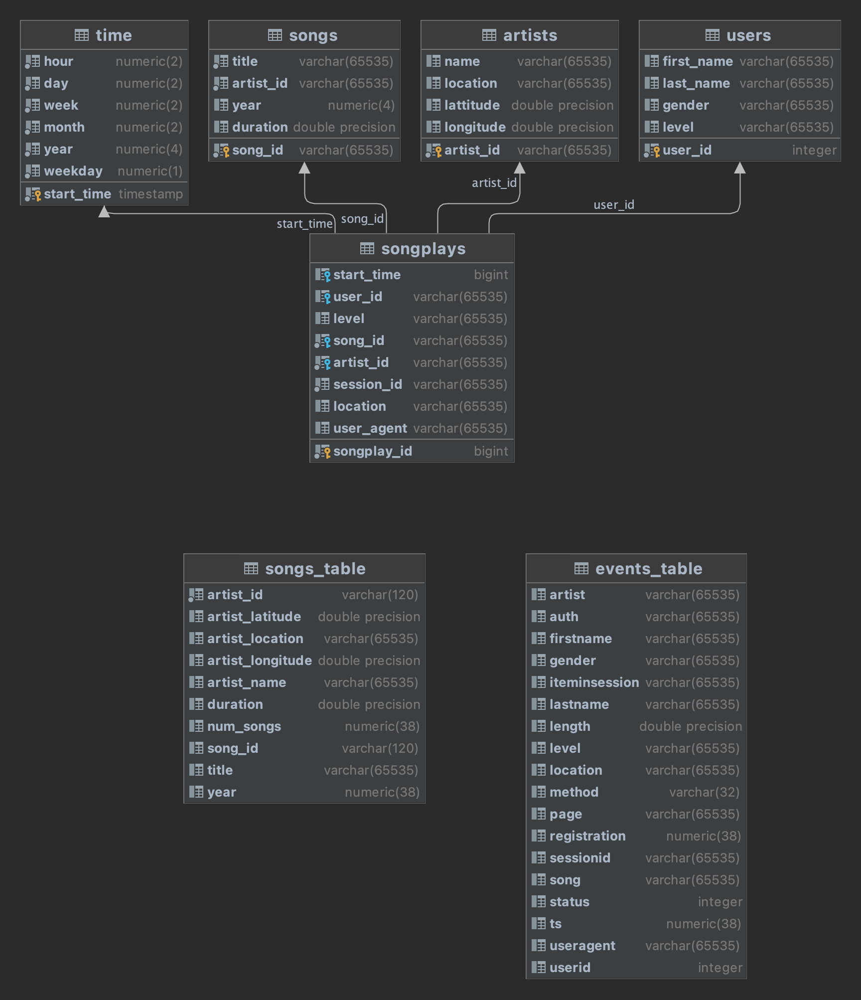

# Data Warehouse Project

This repository contains the solution to the Data Warehouse project for the Udacity Nanodegree 'Data Engineer.'

## Code Overview

The project is built on a few major stages.
First the cluster is created using create_cluster.py.
Next, the tables are created and populated on the cluster using etl.py.

In the remainder of this document we will explain these two phases in more detail.

### File `create_cluster.py`

This file is not part of the project template, but added by us to make it easier to set up and tear down the cluster in
AWS.

To set up the Amazon infrastructure, you need to provide credentials for the API.
Fill these in the `dwh.cfg` file.
Once you have done that, you can deploy the required infrastructure.

To create the cluster, execute

```bash
python create_cluster.py create
```

To check on the status of the cluster execute

```bash 
python create_cluster.py info
```

To tear down and clean up the cluster, run

```bash
python create_cluster.py cleanup
```

**Always verify by hand if your clusters have been cleaned up!**

### File `create_tables.py`

When this file is run, it creates the necessary tables on the cluster.
It also deletes all previously created tables.
The queries that are executed are defined in `sql_queries.sql`.
In brief, the following effects are executed.

The following staging tables are created:

- Table `songs_table` is one of two staging tables that is used to read in the song details from the s3
  bucket `s3://udacity-dend/song_data`.
- Table `events_table` is the second staging table used to read in the events details from s3
  bucket `s3://udacity-dend/log_data/`.

Based on the above staging tables, the following domain and facts tables are created:

- Table `time` contains all timestamps found in the event log, split into hour, day, week, month, year, and weekday.
- Table `songs` contains all the songs encountered in the event logs.
- Table `artists` contains all artists found in the songs files.
- Table `users` contains all users found in the events. Warning: when a user was found with the same id, same name, and
  same last name, but different levels, the premium level is chosen.
- Table `songplays` is the fact table that contains all events of song plays.



### File `etl.py`

The ETL file copies data from the s3 buckets into the two staging tables. 
Then, queries are executed to populate the dimension and fact tables.

## Datasets

This project uses two major data sets. A bunch of events from an app called Sparkify, and a bunch of song data from the 'Million Song Dataset.'

### Songs

This project works with a subset of the 'Million Song Dataset', where a bunch of JSON files contains metadata about
songs and the artist of that song.
The files are partitioned according to the first three letters of the song and its track id.

An example of such a file is shown below.

```json
{
  "num_songs": 1,
  "artist_id": "ARJIE2Y1187B994AB7",
  "artist_latitude": null,
  "artist_longitude": null,
  "artist_location": "",
  "artist_name": "Line Renaud",
  "song_id": "SOUPIRU12A6D4FA1E1",
  "title": "Der Kleine Dompfaff",
  "duration": 152.92036,
  "year": 0
}
```

### Logs

A second dataset contains logs that represent user interactions with an application. An imaginary music streaming
service. God knows what that could be!
Each file contains a specific day of events, so files are partitioned per day.

## Running The Project

To run the project, first, create a Python virtual environment in the root directory of this project.

```bash
python3 -m venv venv
```

Next, install the necessary dependencies.

```bash 
pip install -r requirements.txt
```

Create a cluster on Amazon.

```bash 
python create_cluster.py create
```

Set up the tables. 

```bash 
python create_tables.py
```

Finally, populate the tables. 

```bash 
python etl.py
```
